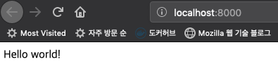
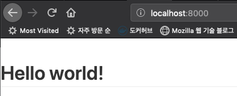

개츠비로 블로그를 만들고 약 2주가 지났는데, 만들었던 과정을 되돌아 보는 의미에서 `gatsby` 로 블로그를 만드는 것을 정리하는 글이다.

상세하게 보는것 보다는 이 사람은 이렇게 했구나 정도로 봐주면 될 것 같다.

### 프로젝트 생성하기

나는 기본 개츠비 디자인이 그렇게 마음에 들지도 않았고, 개츠비를 처음부터 잘 써보고 싶어서 `hello world` 만 나오는 starter 를 사용했다.

아래 명령을 실행하면, myblog 디렉토리가 생성된다.

```shell
$ gatsby new myblog https://github.com/gatsbyjs/gatsby-starter-hello-world
```

아래 명령으로 개발버전의 서버를 띄울 수 있다.

```shell
$ cd myblog
$ gatsby develop

### 서버가 뜨면 http://localhost:8000/ 접속

```

> 여기까지 써놓고 이미지 불러오는걸 못해서 한참 헤맸다..

아래와 같이 'Hello world!' 를 발견활 수 있다.



### 플러그인들 설치하기

아래의 플러그인들을 설치할 것이다.

- gatsby-source-filesystem : 파일 정보를 가져오는 플러그인
- gatsby-transformer-remark : 마크다운을 html로 변환하는 플러그인
- gatsby-plugin-typography : 폰트를 일괄로 관리하기 위한 플러그인
- gatsby-plugin-layout : 레이아웃을 만들때 사용하는 플러그인
- gatsby-plugin-emotion : ccs in js 를 할 수 있게 하는 플러그인
- gatsby-remark-prismjs : 소스코드를 이쁘게 보여줄 때 사용

아래 명령어로 설치를 할 수 있다. `gatsby` 로 시작하지 않는 라이브러리는 의존성 라이브러리 이므로 같이 설치해주어야한다.

```bash
npm install --save gatsby-source-filesystem
npm install --save gatsby-transformer-remark
npm install --save gatsby-plugin-typography react-typography typography typography-theme-github
npm install --save gatsby-plugin-layout
npm install --save gatsby-plugin-emotion @emotion/core
```

지금 쓰는 글은 개츠비를 맛만 보는 형식이기 때문에 각각의 플러그인에 대해서는 글을 하나씩 적을 정도의 양이니 최소한의 설명만 할것이다.

### 폰트 설정

무슨 테마를 사용할지 설정을 해줘야하는데, `src/utils/typography.js` 파일을 하나 만들자. 그리고 내용은 아래와 같이 해주자.

```javascript
import Typography from "typography"
import githubTheme from "typography-theme-github"

const typography = new Typography(githubTheme)

export const { scale, rhythm, options } = typography
export default typography
```

그리고 위의 폰트 테마 설정을 사용할 것이라는 것을 개츠비에게 알려줘야 하는데, 해당 설정은 `gatsby-config.js` 파일에 해주면 된다.

`gatsby-config.js` 파일에 아래의 내용을 추가하자. `gatsby-config.js` 가 변경되면 서버를 재시작해줘야 반영이 된다. 기동중인 개츠비를 끄고, `gatsby develop`를 다시 실행해주자.

```javascript
module.exports = {
  /* Your site config here */
  plugins: [
    {
      resolve: `gatsby-plugin-typography`,
      options: {
        pathToConfigModule: `src/utils/typography`,
      },
    },
  ],
}
```

#### 폰트 설정 확인해보기

`src/pages/index.js` 를 보면 `<div>Hello world!</div>` 라고 되어 있다. div 는 스타일이 적용 안된경우가 많으므로 그 부분을 `<h1>Hello world!</h1>` 로 변경해보자. Hello world 밑에 밑줄이 그여져 있는데 해당 부분은 github 폰트 테마를 적용했기 때문에 변경된 것이므로 잘 변경된 것이 맞다고 보면 된다.



### 레이아웃

### 마크다운으로 글쓰기
