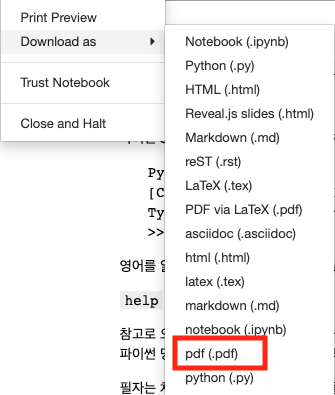
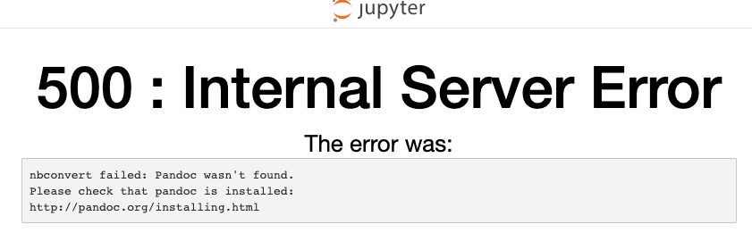
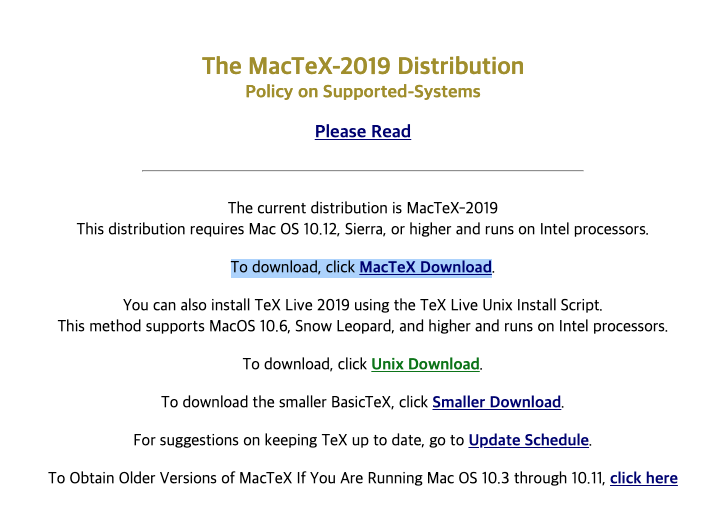

### 주피터를 저작도구로 사용하기 시작했다

최근에 여가시간을 다 보내고도 시간이 남을때 책을 쓰고 있다. 

책을 쓰려면 저작도구가 필요한데, 회사 사람이 책 저작도구로 `jupyter notebook` 을 사용했다고 하여, 
책을 쓰는 용도로 써보니 확실히 개발관련책, 특히나 파이썬 책을 쓰는데에는 아주 좋았다. 
그런데 문제는 여기서 작성한 글을 pdf 로 뽑아낼때 발행했는데...





File -> Download as -> pdf 를 클릭하면 아래와 같이 에러가 난다. 





### pandoc 과 MacTeX 설치

내용인 즉슨 [pandoc을 설치해라](http://pandoc.org/installing.html) 이다.
맥에서는 `$ brew install pandoc` 으로 설치가 가능하다. 

설치후 다시 클릭해보면 
`xelatex` 가 패스에 없다는 에러가 뜬다. `xelatex` 가 없으면 설치하라는 말도 덧붙인다. 
아래 [링크](https://nbconvert.readthedocs.io/en/latest/install.html#installing-tex)를 따라 또 설치를 하러 가보자.  

```
nbconvert failed: xelatex not found on PATH, if you have not installed 
xelatex you may need to do so. Find further instructions at 
https://nbconvert.readthedocs.io/en/latest/install.html#installing-tex.
```

링크를 가보면 `Installing Tex` 라고 떡 하니 `TeX` 를 설치해줘야 하는 것 같다. 
mac은 `MecTeX` 라는것을 설치하면 된다. 

[http://tug.org/mactex/](http://tug.org/mactex/) 에서 



[링크](http://tug.org/cgi-bin/mactex-download/MacTeX.pkg)를 눌러서 패키지를 다운받아서 설치하자. (참고로 굉장히 오래걸린다)

MacTex를 설치하자. (pdf 변환하려고 이걸 설치해야하는건 좀 과한거 아닌가라는 생각이 들기시작했다.) 

nbconvert 도 설치해야하는 것 같으니 이것도 설치해주자. 

```
pip install nbconvert
```

